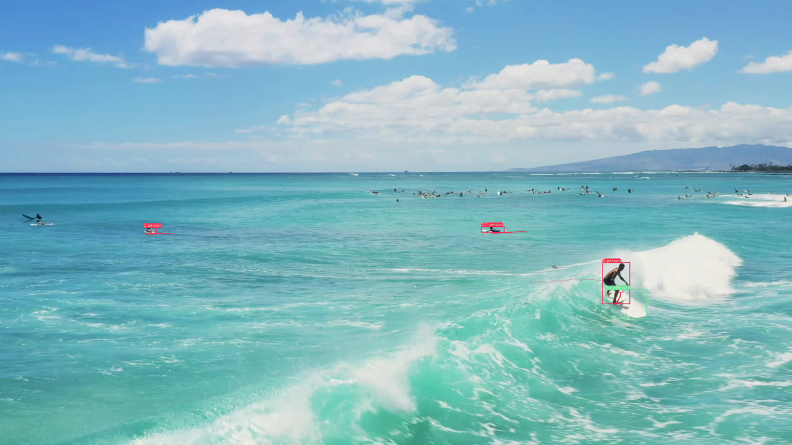
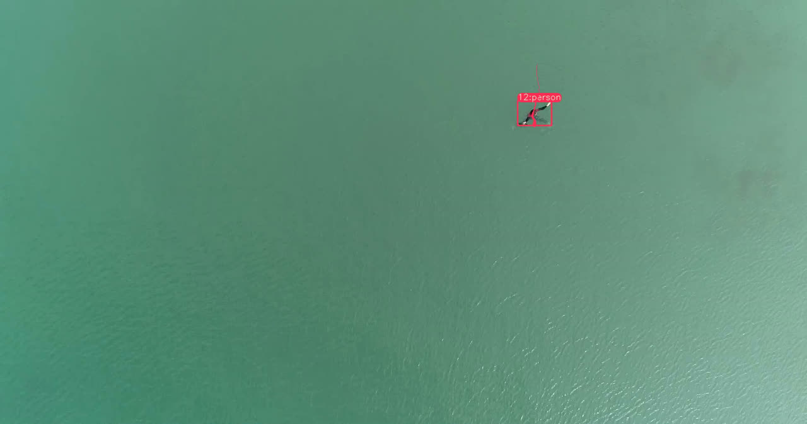
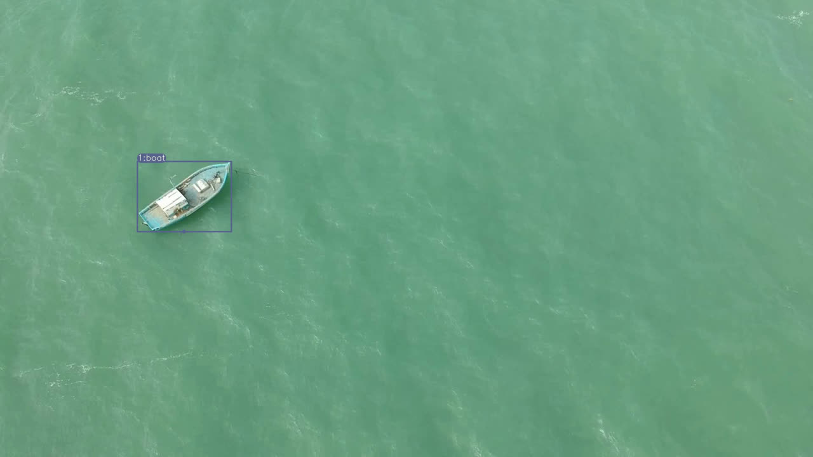
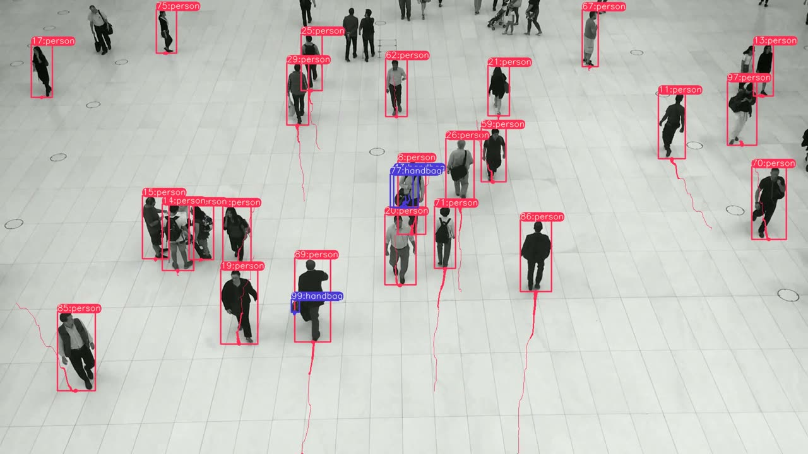

# Accurate Object Tracking Framework for Drone-Based Marine Surveillance

Multi-object detection and tracking for UAV footage over water: YOLOv8 for
per-frame detection, DeepSORT for identity association across frames. Built for
man-overboard search and rescue, anti-poaching patrol and coastal monitoring,
where the target is a few dozen pixels wide and the background will not hold
still.

B.Tech Computer Science capstone (BCSE497J), VIT Chennai, November 2024.

[](https://www.python.org/)
[](https://pytorch.org/)
[](LICENSE)

---

## Demo

Persistent track IDs with motion trails. Each box carries a stable integer ID
that survives occlusion, and the trail behind it is the object's recent path.

| Surfers: person and surfboard tracked as separate classes | Man overboard: single swimmer held across frames |
|:---:|:---:|
|  |  |

| Moored vessel at altitude | Dense crowd, identity retention under overlap |
|:---:|:---:|
|  |  |

The man-overboard frame is the case the framework is really for: a single person
in open water at roughly 30 m altitude, occupying about 0.1% of the frame, held
under a stable ID as swell moves them around.

---

## Why marine footage is hard

Aerial marine surveillance breaks most of the assumptions that make tracking on
land tractable:

- **The background moves.** Wave action means no static reference. Frame
  differencing and background subtraction are unusable.
- **Targets are tiny.** A swimmer at 30-60 m altitude is tens of pixels. There is
  almost no appearance signal to re-identify from.
- **Specular glare.** Sun on water produces bright, moving highlights that read as
  false positives.
- **Targets vanish and return.** Swell hides a swimmer for a second at a time.
  A tracker that drops the ID on every occlusion is useless for rescue, because
  the count of people in the water is the number that matters.

The two-stage design addresses the last point directly: detection is stateless
and per-frame, so the tracker is what carries identity through the gaps.

---

## How it works

```
UAV video
    |
    v
+-------------------------------+
|  YOLOv8 detector              |   per frame: boxes, classes, confidence
|  (yolov8l, COCO or MOBDrone)  |   NMS at IoU 0.7, conf 0.25
+-------------------------------+
    |  xywh boxes + confidences + class ids
    v
+-------------------------------+
|  DeepSORT tracker             |
|                               |
|  Kalman filter    ---------> predicts next position from velocity,
|                              bridges frames with no detection
|  CNN re-ID        ---------> 512-d appearance embedding per crop,
|                              cosine distance for matching
|  Hungarian assign ---------> cost = motion (Mahalanobis) + appearance,
|                              solves detection-to-track assignment
+-------------------------------+
    |  stable track ids
    v
Annotated video: boxes, class labels, persistent IDs, 64-frame motion trails
```

The interesting seam is `write_results` in
[predict.py](ultralytics/yolo/v8/detect/predict.py#L193), which hooks the
Ultralytics `BasePredictor` lifecycle. Detections are converted to
centre-format boxes, handed to `deepsort.update`, and the returned tracks are
rendered by `draw_boxes`. Trails come from a per-ID `collections.deque` capped at
64 points, so memory stays bounded no matter how long the video runs.

### Tracker configuration

From [deep_sort.yaml](ultralytics/yolo/v8/detect/deep_sort_pytorch/configs/deep_sort.yaml):

| Parameter | Value | Effect |
|---|---|---|
| `MAX_DIST` | 0.2 | Cosine distance ceiling for an appearance match |
| `MIN_CONFIDENCE` | 0.3 | Detections below this never enter the tracker |
| `MAX_IOU_DISTANCE` | 0.7 | IoU gate on the assignment cost |
| `MAX_AGE` | 70 | Frames a track survives unmatched before deletion |
| `N_INIT` | 3 | Consecutive hits before a tentative track is confirmed |
| `NN_BUDGET` | 100 | Appearance vectors retained per track |

`MAX_AGE` of 70 is the parameter that matters most for marine work. At 30 fps it
keeps a track alive through roughly two seconds of occlusion, which is about the
duration of a swell hiding a swimmer. Note this differs from the value discussed
in the project report; the committed configuration is what produced the demos
above.

---

## Repository layout

```
.
├── ultralytics/                          Vendored Ultralytics YOLOv8 8.0.3
│   └── yolo/v8/detect/
│       ├── predict.py                    Detection + DeepSORT + trail rendering
│       ├── train.py                      Fine-tuning entry point
│       ├── val.py                        Evaluation entry point
│       └── deep_sort_pytorch/            Kalman filter, Hungarian, CNN re-ID
├── configs/
│   └── mobdrone.yaml                     Portable MOBDrone dataset config
├── notebooks/
│   ├── 01_tracking_pretrained_colab.ipynb    End-to-end tracking on Colab
│   └── 02_mobdrone_finetune_colab.ipynb      MOBDrone fine-tuning on Colab
├── assets/                               Result stills
├── docs/project-report.pdf               Full report, 72 pages
├── NOTICE                                Third-party attribution and changes
└── LICENSE                               GPL-3.0
```

Ultralytics is vendored rather than pip-installed on purpose. This code extends
`BasePredictor.write_results`, and that extension point was reshaped after 8.0.3,
so a current `pip install ultralytics` will not run it. See [NOTICE](NOTICE).

---

## Setup

Python 3.8-3.10. Newer versions will fight the pinned Hydra and Torch
requirements of Ultralytics 8.0.3. A CUDA GPU is strongly recommended; the CNN
re-ID step is the bottleneck on CPU.

```bash
git clone https://github.com/Jefferson0511/Accurate-Object-Tracking-Framework-for-Drone-Based-Marine-Surveillance.git
cd Accurate-Object-Tracking-Framework-for-Drone-Based-Marine-Surveillance

python -m venv .venv
source .venv/bin/activate        # Windows: .venv\Scripts\activate

pip install -e '.[dev]'
```

### Fetch the DeepSORT re-ID checkpoint

The tracker needs the appearance-descriptor weights (`ckpt.t7`, 46 MB). Not
redistributed here, so pull them once:

```bash
cd ultralytics/yolo/v8/detect
pip install gdown
gdown "https://drive.google.com/uc?id=11ZSZcG-bcbueXZC3rN08CM0qqX3eiHxf&confirm=t"
unzip deep_sort_pytorch.zip
```

The archive carries the full `deep_sort_pytorch` folder; only the checkpoint is
missing from this repo, and it must land exactly here:

```
ultralytics/yolo/v8/detect/deep_sort_pytorch/deep_sort/deep/checkpoint/ckpt.t7
```

`predict.py` resolves that path relative to the working directory, so all
commands below are run from `ultralytics/yolo/v8/detect`.

### Detector weights

COCO-pretrained weights download automatically on first use. `yolov8l.pt` (88 MB)
is what produced the demos above.

---

## Usage

### Tracking with COCO-pretrained weights

Works out of the box on marine footage for the `person`, `boat` and `surfboard`
classes, which covers most of the man-overboard scenario.

```bash
cd ultralytics/yolo/v8/detect
python predict.py model=yolov8l.pt source="your_video.mp4"
```

Output lands in `runs/detect/train*/`. Useful flags:

```bash
python predict.py model=yolov8l.pt source="your_video.mp4" \
    show=True \          # live preview window
    conf=0.3 \           # raise to cut glare false positives
    iou=0.5 \            # NMS IoU threshold
    save_txt=True        # write per-frame labels
```

A webcam or RTSP stream works as a source too:

```bash
python predict.py model=yolov8l.pt source=0
python predict.py model=yolov8l.pt source="rtsp://<uav-stream>"
```

### Fine-tuning on MOBDrone

MOBDrone is not redistributed. Pull the Roboflow export, which has the five
marine classes (`boat`, `life_buoy`, `person`, `surfboard`, `wood`) already in
YOLO format:

```bash
export ROBOFLOW_API_KEY="your_key_here"     # Windows: set ROBOFLOW_API_KEY=...
python -c "
import os
from roboflow import Roboflow
rf = Roboflow(api_key=os.environ['ROBOFLOW_API_KEY'])
rf.workspace('mobdrone').project('mobdrone').version(1).download('yolov8')
"
```

Then train and evaluate:

```bash
cd ultralytics/yolo/v8/detect
python train.py model=yolov8l.pt data=MobDrone-1/data.yaml epochs=50 imgsz=640 batch=16
python val.py   model=runs/detect/train/weights/best.pt data=MobDrone-1/data.yaml
python predict.py model=runs/detect/train/weights/best.pt source="your_video.mp4"
```

On Windows, pass `workers=0` if the dataloader raises `MemoryError`. The
spawn-based multiprocessing start method pickles the whole dataset object per
worker, which is what broke the original run for this project.

---

## Results

Reported in the project report, on MOBDrone (66 videos, ~126k frames, 10-60 m
altitude), against published baselines:

| Method | Recall | Precision | F1 |
|---|---|---|---|
| YOLOX + ByteTrack | 83.5 | 89.3 | 86.8 |
| YOLOX-XL + OC-SORT | 85.2 | 90.1 | 87.6 |
| YOLOv7 + MoveSORT | 86.7 | 90.9 | 88.8 |
| YOLOv7 + StrongSORT | 87.1 | 91.2 | 89.1 |
| **YOLOv8 + DeepSORT** | **88.7** | **92.9** | **90.75** |

Full methodology, literature review and analysis: [docs/project-report.pdf](docs/project-report.pdf).

### Reproducibility

Being precise about which numbers this repository backs, and which it does not.

**What is reproducible here.** The tracking pipeline. Every demo image above was
produced by the committed `predict.py` running COCO-pretrained `yolov8l` on
drone marine footage, and re-running the command in [Usage](#usage) on your own
video reproduces that behaviour directly.

**What is not.** The comparison table above is not regenerated by this code. The
MOBDrone fine-tune was set up and launched but did not complete: it failed with a
`MemoryError` in the Windows dataloader on the available hardware, so no
MOBDrone-trained checkpoint exists in this repository. Treat the table as the
literature comparison presented in the report, not as an artifact of this code.

Two related traps worth flagging, since both would mislead anyone reading the
original submission:

- The confusion matrix and validation metrics that appeared in the fine-tuning
  notebook's saved outputs were **not from this project**. They came from the
  upstream author's vehicle dataset (`car`, `pickup`, `truck`, `plane`), carried
  along in the forked notebook. Those outputs are stripped here.
- The submitted code had COCO class 33 relabelled from `kite` to `person` across
  five dataset YAMLs. That edit does nothing at inference time, because class
  names for a pretrained checkpoint are read from the `.pt` file, and it would
  have quietly corrupted any COCO training run. Canonical names are restored;
  see [NOTICE](NOTICE).

Short local experiments that *are* real, from exploratory runs on the MOBDrone
export: `yolov8n` trained from scratch for 3 epochs reached mAP50 0.338 /
mAP50-95 0.181. That is a sanity check on the data pipeline, not a result.

---

## Limitations and next steps

Honest assessment of where this framework stands:

- **No completed fine-tune.** The headline gap. COCO-pretrained weights get
  `person` and `boat` for free, but `life_buoy` and `wood` need the MOBDrone
  training run to finish. Fixing this is mostly an infrastructure problem:
  `workers=0` on Windows, or run it on Colab or a Linux box.
- **Appearance re-ID is weak at altitude.** The DeepSORT descriptor was trained
  on pedestrian crops. At 60 m a swimmer carries almost no texture, so the
  cosine term contributes little and assignment leans almost entirely on Kalman
  motion. A re-ID network fine-tuned on small aerial crops would help more than
  any detector upgrade.
- **Not evaluated with tracking metrics.** Precision, recall and F1 measure
  detection. MOTA, MOTP and ID-switch counts are the metrics that would actually
  quantify the tracking contribution, and computing them needs the MOBDrone
  track-level ground truth.
- **Untested on-board.** The report frames this as UAV-deployable; it was only
  ever run on desktop hardware. `yolov8l` at 165 GFLOPs will not hit real time on
  an embedded board. Jetson deployment means `yolov8n`, INT8 quantization and a
  TensorRT export.
- **Glare is unhandled.** No specular-highlight suppression. Raising `conf`
  trades false positives for missed detections, which is the wrong trade for
  search and rescue, where a missed swimmer costs more than a false alarm.

---

## Citation

If the MOBDrone dataset is useful to you, cite the authors who built it:

```bibtex
@inproceedings{cafarelli2022mobdrone,
  title     = {MOBDrone: A Drone Video Dataset for Man OverBoard Rescue},
  author    = {Cafarelli, Donato and Ciampi, Luca and Vadicamo, Lucia and
               Gennaro, Claudio and Berton, Andrea and Paterni, Marco and
               Benvenuti, Chiara and Passera, Mirko and Falchi, Fabrizio},
  booktitle = {Image Analysis and Processing (ICIAP)},
  series    = {LNCS},
  volume    = {13232},
  year      = {2022}
}

@inproceedings{wojke2017deepsort,
  title     = {Simple Online and Realtime Tracking with a Deep Association Metric},
  author    = {Wojke, Nicolai and Bewley, Alex and Paulus, Dietrich},
  booktitle = {IEEE International Conference on Image Processing (ICIP)},
  year      = {2017},
  doi       = {10.1109/ICIP.2017.8296962}
}
```

---

## Authors

Submitted as a group capstone at VIT Chennai, School of Computer Science and
Engineering, November 2024, under the supervision of **Dr. Ancy Micheal**,
Assistant Professor.

- **Jefferson David Kingston** ([@Jefferson0511](https://github.com/Jefferson0511))
- **Bharat P**
- **Adithya V**

---

## License

GPL-3.0, inherited from the vendored Ultralytics YOLOv8 8.0.3 tree. See
[LICENSE](LICENSE) for the full text and [NOTICE](NOTICE) for component-level
attribution, upstream sources and a record of every change made here.
